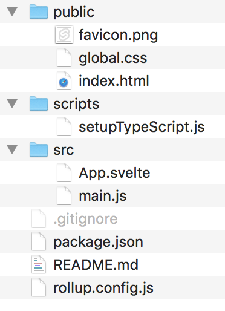

# Add FusionCharts To Your Svelte Projects

## Step 1: Create a Svelte Project
Create a folder for your svelte project by typing the following at the command line:

```
npx degit sveltejs/template svelte-fusion-chart-demos
```

This will create a project folder called svelte-fusionchart-demo with the following directory structure. 



There are public, scripts and src folders. You only need to change code in the App.svelte file and main.js located in the src folder.

Next at the command line type the following:

```
cd my-first-svelte-project
npm install
npm install svelte-fusioncharts fusioncharts --save
```

## Step 2: Add Code to App.svelte
Add the main code to App.svelte

## Step 3: Add code to main.js

In the main.js file add the import section to import the app.

## Step 4: Run the App

```
npm run dev 
```

When the server runs, it will show the portnumber to use with localhost. Open your browser and view the app.